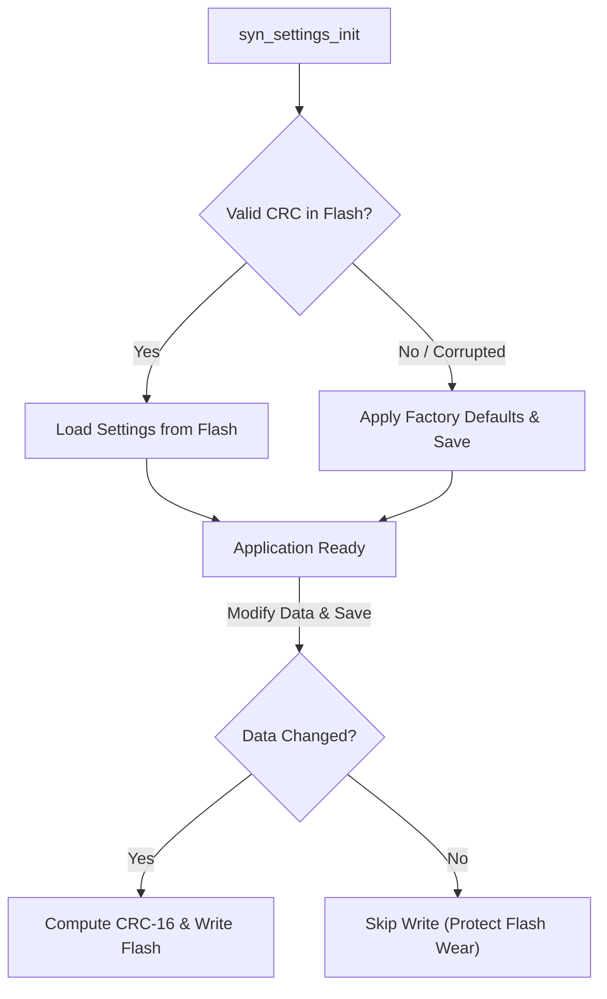
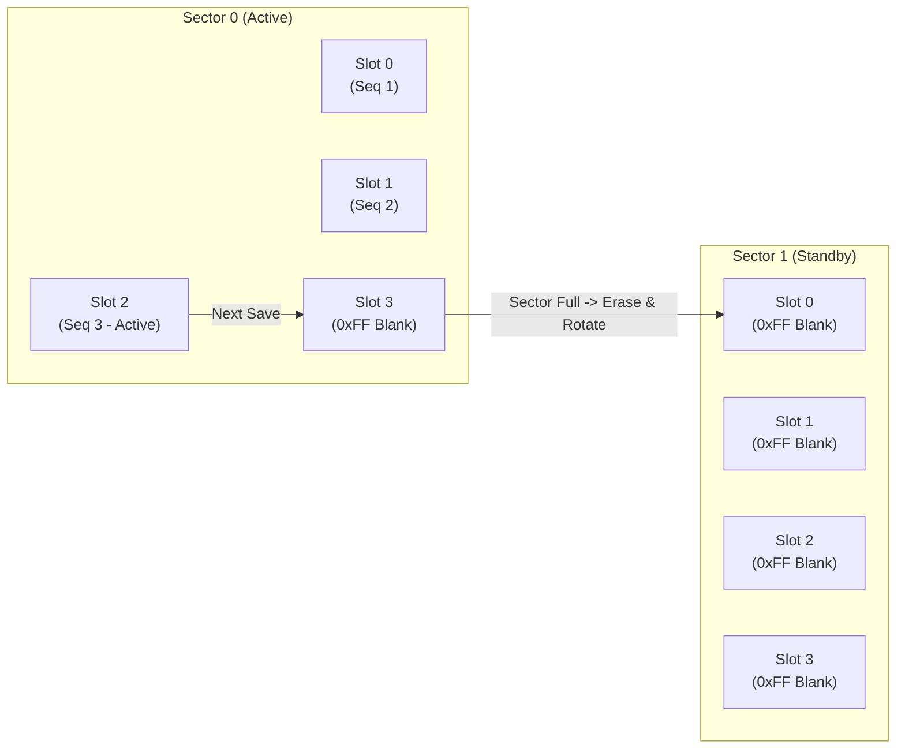

# Storage & Non-Volatile Memory Modules

SyntropicOS provides persistent storage components scaling from wear-leveled flash parameters to virtual filesystem abstractions supporting LittleFS and FAT.

---

## 1. Persistent Settings Manager (`syn_settings.h`)

The `syn_settings` module simplifies non-volatile configuration management. It wraps `syn_param` to provide:
- **Load-or-Default Initialization**: Loads saved configuration from flash on startup, automatically applying factory default values if flash is uninitialized or corrupted.
- **CRC-16 Checksum Validation**: Automatically tracks data integrity and detects changes.
- **Wear-Leveling Protection**: Prevents unnecessary flash erase cycles by only writing when data actually changes.
- **Change Callbacks**: Triggers application callbacks when settings are updated.

### Storage Pipeline Flow



### Complete Code Example

```c
#include <syntropic/storage/syn_settings.h>

// Define custom application configuration struct
typedef struct {
    uint32_t baud_rate;
    uint16_t node_id;
    uint8_t  display_brightness;
} SystemConfig;

// Factory default values
static const SystemConfig default_config = {
    .baud_rate = 115200,
    .node_id = 0x01,
    .display_brightness = 80
};

static SystemConfig active_config;
static SYN_Settings settings_store;

void on_config_changed(SYN_Settings *store, void *ctx) {
    printf("Config updated! New Node ID: 0x%02X\n", active_config.node_id);
}

void app_init(void) {
    // Flash sector base address = 0x080E0000, Sector Copies = 2 (ping-pong wear leveling)
    syn_settings_init(&settings_store, 0x080E0000, 2,
                      &active_config, sizeof(active_config), &default_config);

    // Register callback for when settings change
    syn_settings_on_change(&settings_store, on_config_changed, NULL);

    printf("Active Baud Rate: %lu\n", (unsigned long)active_config.baud_rate);
}

void update_node_id(uint16_t new_id) {
    active_config.node_id = new_id;
    
    // Computes CRC-16 and writes flash ONLY if node_id actually changed
    syn_settings_save(&settings_store);
}
```

---

## 2. Flash Wear-Leveling Engine (`syn_param.h`)

The `syn_param` module provides low-overhead, power-fail-safe, wear-leveled storage directly on raw Flash sectors or pages without requiring a filesystem.

### Architecture & Memory Layout

Flash is divided into $K$ contiguous sectors or pages. Each sector is partitioned into fixed-size slots aligned to 16-byte boundaries:



### Slot Structure

Each slot consists of a 16-byte metadata header followed by the caller's parameter data:

```
+------------------+------------------+-------------------+------------------+--------------------+------------------------+
| magic (2 bytes)  |  seq (2 bytes)   | data_size (2 B)   |  crc (2 bytes)   |  pad (8 bytes)     |  Payload (data_size B) |
|     0xC0DE       |  Incrementing    | User Struct Size  |  CRC-16-CCITT    |  0x00 / Reserved   |  Raw Struct Binary     |
+------------------+------------------+-------------------+------------------+--------------------+------------------------+
|<----------------------------- 16-Byte Slot Header ---------------------------->|<------ Aligned Data Payload --------->|
```

### Core Principles

1. **Sequential Append Writes**:
   - Updates are written to the next blank slot in the current sector (`active_slot++`) without erasing flash.
   - Flash write alignment is enforced via `align16(sizeof(SYN_ParamSlotHeader) + data_size)` to satisfy MCU flash programming parallelism constraints.

2. **Circular Sector Rotation & Erase Minimization**:
   - When all slots in `active_sector` are exhausted (`active_slot >= slots_per_sector`), the store rotates to the next sector:
     $$\text{active\_sector} = (\text{active\_sector} + 1) \pmod{\text{sector\_count}}$$
   - Only the incoming sector is erased (`syn_port_flash_erase`).
   - Total write cycles before any single flash sector reaches its physical erase endurance limit ($E$):
     $$\text{Total Lifetime Writes} = E \times \text{sector\_count} \times \left\lfloor \frac{\text{sector\_size}}{\text{slot\_size}} \right\rfloor$$
     *Example: 2 sectors of 4 KB storing a 16-byte payload ($\text{slot\_size} = 32\text{ bytes}$) yields $128 \text{ slots/sector} \times 2 \times 10,000 \text{ cycles} = \mathbf{2,560,000\text{ write cycles}}$.*

3. **Two-Phase Atomic Commit Protocol**:
   - **Phase 1 (Payload Write)**: The parameter payload is written to flash at `slot_addr + sizeof(SYN_ParamSlotHeader)`.
   - **Phase 2 (Header Commit)**: The 16-byte header containing `SYN_PARAM_MAGIC (0xC0DE)` and the CRC-16 checksum is written last.
   - If power is cut during Phase 1, the slot lacks the `0xC0DE` magic signature or fails CRC validation on boot, causing the engine to cleanly ignore the partial write and retain the previous valid slot.

4. **Boot Recovery & Sequence Integer Rollover**:
   - On boot, `syn_param_init()` scans all slots across all configured sectors.
   - Sequence comparisons use signed 16-bit modular arithmetic:
     $$\text{is\_newer} = ((\text{int16\_t})(\text{hdr.seq} - \text{best\_seq}) > 0)$$
   - This handles 16-bit sequence number rollover ($65535 \rightarrow 0$) seamlessly without data loss.

5. **Power-Loss Fault Recovery Matrix**:

| Fault Scenario | State of Old Data | State of New Data | Recovery on Reboot (`syn_param_init`) |
|---|---|---|---|
| **Power-loss during Erase** | Intact in previous sector | Partial erase (corrupted bits) | Discards erased sector; recovers latest valid slot from previous sector. Re-erases on next write. |
| **Power-loss during Data Write** | Intact in previous slot | Partial payload | Header missing (`0xFF` != `0xC0DE`); discards incomplete slot and loads previous valid slot. |
| **Power-loss during Header Write**| Intact in previous slot | Corrupted header | Magic / CRC-16 check fails; discards corrupt slot and loads previous valid slot. |

---

## 3. Virtual File System (`syn_vfs.h`)

SyntropicOS provides a unified Virtual File System (VFS) interface to abstract raw storage media (Internal Flash, SPI NOR Flash, SD Cards).

### Features
- Standardized POSIX-like API (`syn_vfs_open`, `syn_vfs_read`, `syn_vfs_write`, `syn_vfs_close`).
- Mount points for LittleFS (`syn_lfs`) and FAT (`syn_fat`).

### Supported Filesystems

| Module | Header | Ideal Use Case |
|---|---|---|
| **LittleFS** | `storage/syn_lfs.h` | NOR Flash memory, power-fail safe, wear-leveled |
| **FAT / FAT32** | `storage/syn_fat.h` | SD Cards, USB Mass Storage, PC-readable drives |
| **Param Store** | `storage/syn_param.h` | Sector-based raw parameter storage without a filesystem |

